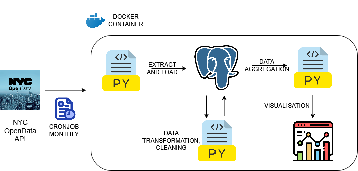

Motor Vehicle Collision ELT Pipeline and Data Analysis Project

The aim of this project is to extract motor vehicle collision data from NYC Open Data website, namely crashes, vehicles and persons data and create analysis of crashes and fatalities based on the obtained data. The data is downloaded and transformed once a month since they are updated retroactively and do not have sufficient specific ids to identify unique rows.

Problem Statement

Downloading the data manually from the website would be a tedious process and processing more than 3 million rows would be impossible to achieve manually. To address this, this pipeline aims to achieve the following:

1) Downloading Motor Vehicle Collisions data(crashes, vehicles, persons) directly into Postgresql using dlt.

2) Transformation of data with Python, Pandas and sqlalchemy directly in Postgresql with a new transformed database. The downloaded file remains in a seperate table(bronze layer) as a backup for the data.

3) The transformed files(silver layer) is further cleaned for nulls and duplicates again with Python Pandas and sqlalchemy.

4) Analytics is then performed on the data and the following aggregates are obtained from the motor vehicle collisions data:

    Time-based Analysis:

    1)Crashes by hour of day
    2)Crashes by day of week and month (seasonal patterns)
    3)Year-over-year trends 

    Geographic Analysis:

    1)Crashes by borough (using the borough column)
    2)Hot spots using latitude/longitude clustering
    3)Zip code analysis for neighborhood-level insights

    Severity Analysis:

    1)Fatality rates by vehicle type or contributing factors
    2)Injury severity distribution (persons injured vs killed)
    3)Pedestrian vs cyclist vs motorist casualty rates

    Contributing Factor Analysis:

    1)Most common contributing factors leading to crashes
    2)Which factors correlate with higher fatality rates
    3)Vehicle-specific contributing factors

    Demographic Patterns:

    1)Age group analysis of persons involved
    2)Gender patterns in different types of crashes
    3)Person type (driver, passenger, pedestrian) injury rates

    Vehicle Analysis:

    1)Most crash-prone vehicle types and makes
    2)Vehicle age vs crash severity
    3)Vehicle occupancy patterns in crashes

Pipeline Overview

Data Ingestion with Python(dlt) and Postgres